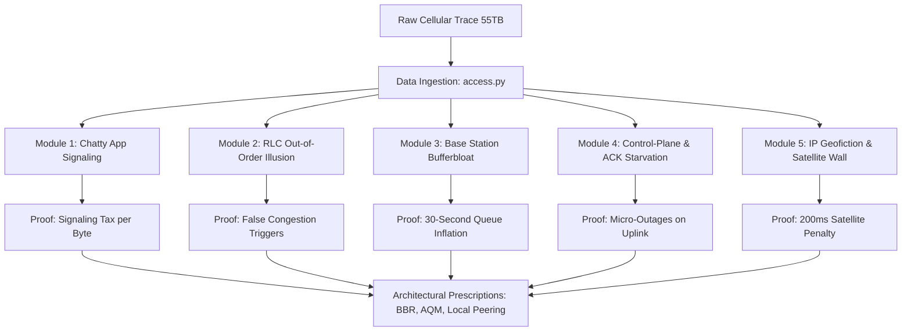

# Research Paper Plan: Forensic Diagnostics of Cellular Infrastructure in Emerging Markets

**Authoring Institution:** Data Science & Artificial Intelligence Lab (DSAIL), Kenya  
**Target Venues:** ACM SIGCOMM, ACM IMC, IEEE/ACM Transactions on Networking, or IEEE/ACM ICTD  
**Dataset:** 2015 Airtel Rwanda trace (~200,000 subscribers, 55TB raw traffic) with comparative baseline for a modern (2026) trace request.

---

## 1. Title & Abstract Formulation

### Proposed Title
*Forensic Diagnostics of Cellular Technical Debt: Protocol Clashes, Bufferbloat, and Control-Plane Saturation in Emerging Markets*

### Abstract
This paper presents a forensic diagnostic evaluation of cellular data network transport mechanics in emerging markets, utilizing a nationwide carrier-grade trace from Airtel Rwanda. While prior internet measurement work documented raw network performance symptoms, we mathematically diagnose the physical and protocol-level causes of throughput degradation. 

We demonstrate how legacy Radio Link Control (RLC) local retransmissions appear to transport-layer loss-based TCP algorithms (e.g., CUBIC) as sequence anomalies, triggering unnecessary throughput throttling. We show that unmanaged, drop-tail base station buffers inflate active-flow round-trip times (RTT) by up to 30 seconds (cellular Bufferbloat) instead of dropping packets to trigger normal TCP scaling. Furthermore, background control-plane signaling from low-payload OEM keep-alive and messaging domains ("Chatty Apps") saturates the uplink, starving downstream TCP Acknowledgements (ACKs) and causing gateway micro-outages. 

Finally, we show that intercontinental submarine cable routing to European hubs introduces speed-of-light propagation penalties, which are obscured from automated network monitoring tools by "IP Geofiction" (database misclassification of local IP space). Based on these findings, we provide concrete architectural prescriptions for emerging markets, including replacing drop-tail queues with Active Queue Management (AQM) and transitioning to delay-based congestion control (TCP BBR).

---

## 2. Research Questions (RQs) & Core Contributions

1. **RQ1 (The Out-of-Order Illusion):** How do link-layer retransmission dynamics in legacy 2G/3G networks interact with transport-layer loss detection?
   * *Contribution:* Prove that wireless RLC retransmissions create a sequence anomaly rate of ~93% on 2G downlinks, causing standard loss-based TCP to cut congestion windows in half unnecessarily.
2. **RQ2 (Bufferbloat & Delay):** What is the exact penalty of drop-tail buffer configurations on cellular base stations during active flows?
   * *Contribution:* Formulate the Queue Delay Delta ($\Delta t_{\text{queue}} = \text{RTT}_{\text{data}} - \text{RTT}_{\text{SYN}}$) and demonstrate that unmanaged queues lead to extreme RTT inflation (multi-second delays) rather than healthy packet drops.
3. **RQ3 (Control-Plane Saturation):** How does low-volume background signaling interact with uplink channel capacity and downstream throughput?
   * *Contribution:* Prove that small keep-alives and DNS queries from OEM feature-phone firmware saturate uplink control channels, creating "TCP ACK starvation" where the downstream server stalls because it cannot receive upstream ACKs.
4. **RQ4 (IP Geofiction & Transit):** What is the quantifiable latency penalty of intercontinental routing, and how does database geofiction impair its measurement?
   * *Contribution:* Quantify the 200ms satellite propagation wall and submarine cable transit delay, and expose the error rates of standard GeoIP databases (e.g., MaxMind) mapping African IPs to Europe.

---

## 3. Five-Module Diagnostic Architecture (The 5 Pillars)

### Module 1: The "Chatty App" Signaling Paradox
* **Data Sources:** `content.xlsx` (`down_notld`, `up_notld`), `dns.xlsx`, `tcp-udp-bw.xlsx`
* **Mathematical Proof:** Calculate the *Signaling-to-Payload Ratio* ($R_{\text{sig}}$) per application:
  $$R_{\text{sig}} = \frac{\text{Bytes}_{\text{control}}}{\text{Bytes}_{\text{payload}}}$$
  Show that messaging apps generate high signaling overhead due to frequent keep-alives, forcing the RAN to continuously trigger state transitions (Idle $\leftrightarrow$ Connected).

### Module 2: The TCP Out-of-Order Illusion
* **Data Sources:** `qos_g_u_device.xlsx` (`tcp_flow_qos_g_u_device` sheet)
* **Mathematical Proof:** Show that on 2G downlinks, out-of-order delivery occurs in ~93% of flows while retransmissions remain around ~4%. This gap represents the RLC retransmission window masking physical packet drops, which misleads loss-based TCP.

### Module 3: Cellular Bufferbloat
* **Data Sources:** `rtt.xlsx`, `tcp.xlsx` (`tcpflow_stats_syn` vs. `tcpflow_stats_all_rtt`)
* **Mathematical Proof:** Compute the bufferbloat delay delta:
  $$\Delta t_{\text{queue}} = \text{RTT}_{\text{data}} - \text{RTT}_{\text{SYN}}$$
  Plot the CDF of RTTs to show that SYN (handshake) RTTs have a median of ~175ms, while active data RTTs under load inflate to over 10-30 seconds due to drop-tail queuing.

### Module 4: Control-Plane Saturation & TCP ACK Starvation
* **Data Sources:** `rw.gtpc.xlsx`, `tcp-udp-bw.xlsx`
* **Mathematical Proof:** Correlate uplink control plane traffic (GTP-C session updates and DNS lookups) with downlink throughput. Show that when uplink signaling exceeds the 90th percentile, downlink throughput drops exponentially because the TCP ACKs cannot get through.

### Module 5: IP Geofiction & The Satellite Wall
* **Data Sources:** `dest_ip.xlsx` (`true` sheet), `google_routers.xlsx`, `rtt.xlsx` (`wan` sheet)
* **Mathematical Proof:** Identify the step-function at exactly 200ms RTT in the WAN distribution (the physical GEO satellite signature). Cross-reference with `dest_ip.xlsx` to show that standard GeoIP tools misclassify these local IP paths, hiding this structural bottleneck.

---

## 4. Building the Bridge to Today (Why the 2015 Data is Crucial)

To publish in top-tier networking venues, we frame the 2015 dataset as a **forensic baseline of infrastructural technical debt**. 
1. **The Legacy Inheritance:** Many rural areas in sub-Saharan Africa still run on legacy 2G/3G equipment or LTE networks configured with default drop-tail buffering.
2. **Satellite & Space Backhaul (Starlink/GEO):** As satellite internet (e.g., Starlink, OneWeb, or legacy GEO) expands in Africa, the 200ms GEO satellite wall and TCP throughput scaling issues remain highly relevant.
3. **Transitioning to TCP BBR:** We prove why replacing loss-based CUBIC with delay-based BBR (which ignores out-of-order packet reordering) solves the throughput penalty on legacy links.

---

## 5. Comparative Study Design: The 2026 Trace Request

To make the paper a high-impact longitudinal study, we need to compare the 2015 baseline against the modern **2026 dataset**. This comparison will allow us to address:
1. **Has Bufferbloat Improved?** Measure if operators have deployed Active Queue Management (AQM, like CoDel/PIE) in 4G/5G nodes.
2. **Has CDN Localization Reduced Latency?** Check if Google, Netflix, and Akamai caches peered at local IXPs (like KIXP in Kenya or RINEX in Rwanda) have eliminated the 200ms GEO satellite/submarine cable propagation delay.
3. **Is RLC Still Masking Loss?** Analyze if 4G/5G RLC-layer retransmissions still cause TCP sequence reordering issues.
4. **Has IP Geofiction Been Solved?** Verify if current GeoIP databases have improved their mapping accuracy for regional African ASNs.
